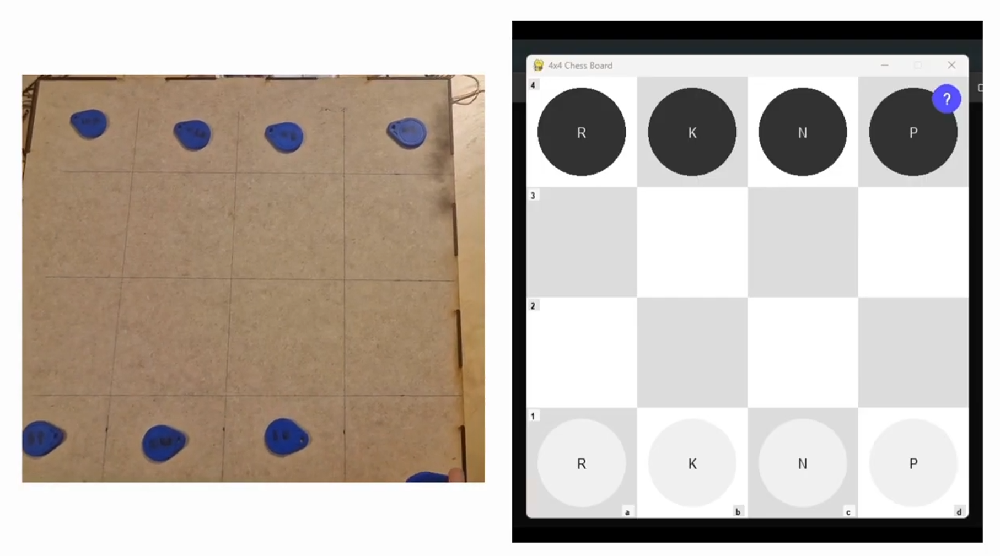

# Modular game board – Embedded System with RFID

Bachelor Thesis Project – Embedded Systems / Interactive Hardware

## Overview

This project was developed as part of a Bachelor’s Thesis and implements a smart interactive chessboard using RFID technology, Arduino hardware, and Python software.

The system detects physical chess pieces using RFID tags embedded in the pieces. Each move made on the board is transmitted to a computer where the game logic is processed and visualized through a graphical interface.

The project demonstrates hardware–software integration, real-time communication, and game logic validation.

---

## Authors

* Joel Andersson
* Noor Aldein Baradee

Bachelor Thesis Project

---

## Features

* RFID-based detection of chess pieces
* Real-time communication between Arduino and Python
* Graphical chessboard interface using Pygame
* Automatic move validation
* LED feedback system for player guidance
* Simplified 4×4 chess rule set

---

## Project Demonstration

[](https://www.youtube.com/watch?v=xy6fE5UnNOM)

---

## System Architecture

The system consists of three main components:

1. **RFID Chessboard Hardware**
2. **Arduino Microcontroller**
3. **Python Game Engine and GUI**

Data flow:

RFID Tag → RFID Reader → Arduino → Serial Communication → Python Software → Game Logic → GUI + LED Feedback

---

## Technologies Used

### Hardware

* Arduino
* RFID Reader (MFRC522)
* RFID Tags embedded in chess pieces
* LED feedback system

### Software

* Python
* Pygame
* PySerial

---

## Repository Structure

```
interactive-modular-game-board/
│
├── hardware/
│       └── chessboard.ino
│
├── software/
│   └── chessboard.py
│
├── docs/
│   └── thesis.pdf
│
└── README.md
```

---

## How the System Works

1. Each chess piece contains an RFID tag with a unique UID.
2. The RFID reader connected to the Arduino detects which piece is placed on a square.
3. The Arduino sends piece information and board position to the Python software through serial communication.
4. The Python program:

   * Identifies the piece using its UID
   * Validates the move according to game rules
   * Updates the board state
5. The Pygame GUI visualizes the board and highlights valid moves.
6. LED signals provide feedback on the physical board.

---

## Installation

### Requirements

Python 3.x

Install required libraries:

```
pip install pygame pyserial
```

---

## Running the Software

1. Connect the Arduino chessboard via USB.
2. Upload the Arduino code to the board.
3. Run the Python program:

```
python chessboard.py
```

The GUI will open and begin listening for data from the Arduino.

---

## Project Purpose

This project explores interactive physical computing by combining embedded hardware with software systems.

Key learning objectives include:

* Embedded system design
* Serial communication protocols
* Real-time event handling
* Hardware–software integration
* Game logic implementation

---

## License

This project was developed for academic purposes as part of a Bachelor’s Thesis.
